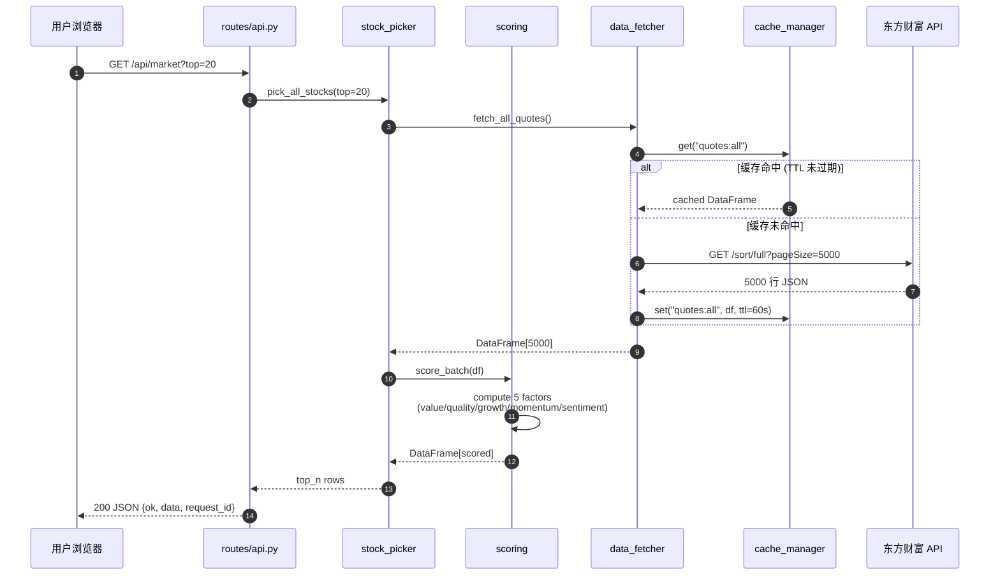

# 架构图 — jztz_v17

本文档用 4 张 Mermaid 图描述 jztz_v17 的整体架构。所有图均可在
GitHub / VSCode / Typora 等支持 Mermaid 的渲染器中直接显示。

---

## 1. 系统总览图 (System Overview)

请求从浏览器到外部数据源的完整路径。

```mermaid
flowchart LR
    User([用户 / 浏览器])

    subgraph Edge["边缘层 (生产环境)"]
        Nginx[Nginx<br/>:443 TLS<br/>SSE 缓冲关闭]
    end

    subgraph App["应用层 (Gunicorn :5000)"]
        Flask[web_app.py<br/>create_app&#40;&#41;]
        Routes["routes/<br/>api · daily · auction<br/>wp2 · strong · ai · health"]
        SSE[/api/sse<br/>SSE 推送/]
    end

    subgraph Modules["业务模块 (modules/)"]
        Picker[stock_picker / strong / auction / wp2]
        Scoring[scoring + technical]
        Fetcher[data_fetcher<br/>async_data_fetcher]
        Cache[cache_manager]
        Logger[logger]
        Health[health checks]
    end

    subgraph External["外部数据源"]
        East[东方财富 API<br/>quote.eastmoney.com]
        AK[akshare]
        WeChat[企业微信 webhook]
    end

    subgraph Infra["基础设施"]
        Disk[(logs/*.log)]
        DiskCache[(data/cache)]
    end

    User -->|HTTPS| Nginx -->|HTTP| Flask
    Flask --> Routes
    Routes --> Picker
    Routes --> SSE
    Picker --> Scoring
    Picker --> Fetcher
    Fetcher --> Cache
    Fetcher -->|HTTP| East
    Fetcher -->|HTTP| AK
    Picker -->|markdown| WeChat
    Logger --> Disk
    Cache --> DiskCache
    Routes --> Health
```



---

## 2. 数据流图 (Data Flow Sequence)

一次"获取实时行情 + 评分"请求的时序（命中缓存 vs 未命中）。



---

## 3. 模块依赖图 (Module Dependency)

`modules/` 内部依赖关系（看哪些模块依赖哪些底层模块）。

```mermaid
flowchart TD
    config[config.py<br/>load_config&#40;&#41;]
    models[models.py<br/>StockQuote / StockScore]
    errors[errors.py<br/>ApiError]
    logger[logger.py<br/>log / set_request_id]
    api_resp[api_response.py<br/>ok/error/paginate]
    http[http_client.py]
    breaker[circuit_breaker.py]
    cache[cache_manager.py]
    cache_cfg[cache_config.py]
    rate[rate_config.py]
    tech[technical.py]
    score[scoring.py]
    ext[external_api.py]
    fetcher[data_fetcher.py<br/>async_data_fetcher.py]
    ai[ai_analyzer.py]
    news[news.py]
    picker[stock_picker.py]
    strong[strong_stock_picker.py]
    auction[auction_picker.py]
    wp2[wp2_picker.py]
    sched[scheduler.py]

    config --> models
    config --> cache_cfg
    config --> rate
    config --> logger
    cache --> cache_cfg
    cache --> logger
    breaker --> logger
    http --> breaker
    http --> logger
    ext --> http
    ext --> breaker
    fetcher --> http
    fetcher --> cache
    fetcher --> models
    fetcher --> logger
    tech --> models
    score --> models
    score --> tech
    score --> logger
    picker --> fetcher
    picker --> score
    picker --> models
    picker --> logger
    strong --> score
    strong --> models
    auction --> score
    auction --> models
    wp2 --> score
    wp2 --> fetcher
    wp2 --> models
    ai --> models
    ai --> news
    sched --> picker
    sched --> strong
    sched --> auction
    sched --> wp2
    sched --> logger

    classDef base fill:#e8f4f8,stroke:#1e88e5
    classDef util fill:#fff3e0,stroke:#fb8c00
    classDef domain fill:#e8f5e9,stroke:#43a047
    class config,models,errors,logger,api_resp base
    class http,breaker,cache,cache_cfg,rate,ext,fetcher util
    class tech,score,picker,strong,auction,wp2,ai,news,sched domain
```



---

## 4. 部署拓扑图 (Deployment Topology)

`docker compose up -d` 之后的运行时拓扑。

```mermaid
flowchart TB
    Internet([公网])
    subgraph Host["Docker Host (1 台)"]
        subgraph Net["bridge 网络: jztz_default"]
            App[app container<br/>jztz_v17:v20<br/>Gunicorn gthread<br/>:5000 内部]
        end
        subgraph Volumes["挂载卷"]
            Logs[/var/lib/docker/volumes/.../logs/]
            Data[/var/lib/docker/volumes/.../data/]
        end
        Redis[(redis:7-alpine<br/>可选 · 已注释)]
    end
    Nginx[Nginx :443<br/>反代 + TLS] -.可选.- Internet

    Internet -->|:5559| App
    App --> Logs
    App --> Data
    App -.->|未来| Redis
    Internet -.可选.-> Nginx
    Nginx -.可选.->|:5000| App

    classDef active fill:#c8e6c9,stroke:#2e7d32
    classDef optional fill:#fff9c4,stroke:#f9a825,stroke-dasharray: 5 5
    class App,Logs,Data active
    class Nginx,Redis optional
```

---

## 关键设计决策

| 决策 | 取舍 |
|---|---|
| **Flask 蓝图** (而非 FastAPI) | 与 v17 既有模板/会话兼容;Flask 在 SSE 生态成熟 |
| **全局内存数据** (DAILY_PICK_DATA 等) | 调度器后台计算 → 主进程全局变量,前端秒级响应,避免重复计算 |
| **Gunicorn gthread** (非 gevent/eventlet) | 兼容 SSE 长连接 + 线程安全 + 无 monkey-patch 风险 |
| **cache_manager** (非 redis) | 单实例够用;落本地磁盘省运维;后续可平滑切 redis |
| **circuit_breaker** (非 retry) | 东方财富 API 偶发限流,3 次失败 → 熔断 60s 比无限重试更友好 |
| **gunicorn 2 workers × 4 threads** | 8 并发足够 A 股开盘流量;CPU 友好;SSE 不会因 worker 太少被卡 |
| **非 root 用户 jztz** (uid 1000) | 容器安全基线,符合 CIS Docker Benchmark |

---

## 部署相关

参见 [`DEPLOY.md`](../DEPLOY.md) 获取生产部署的 4 种方式 (Docker /
Compose / systemd / Windows waitress) + Nginx 反代 + TLS + 监控 +
日志聚合 + 回滚 + 故障排查。
